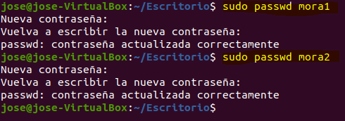

### José Antonio Mora Cairós 2º ASIR

# 3 Servidor LTSP 

## 3.1 Preparar la MV Server 

En este primer punto crearemos la máquina virtual de Ubuntu Server, donde le pondremos las siguientes características:

+ Una interfaz de red en modo puente.
+ Una interfaz de red en modo red interna.
    + Con la IP 192.168.67.1
    + Máscara de clase C.
    + Sin puerta de enlace. 

## 3.2 Instalación del SSOO

+ Instalar un sistema operativo en la MV del servidor, que será el Ubuntu 20. 

+ Agregamos algunos comandos, que nos pide la práctica y que están marcados en amarillo.

+ Creamos dos usuarios locales. Y le agregamos una contraseña. Lo mostraré en la siguiente captura.
    + mora1
    + mora2 

+ Comprobamos que se puede entrar en el servidor con los tres usuarios. Lo demostraré con un video al final de la práctica. 

# 3.3 Instalar el servicio LTSP 

+ Instalar servidor de clientes ligeros. A continuación mostraré una captura de pantalla con el comando especificado. 

.

+ Con el siguiente comando, crearemos una imagen de 64 bits del SO. 

    + Usaremos el comando siguiente que se verá en la captura. 

 

+ Ejecutamos el siguiente comando para consultar la información: 

# 3.4 Configuración

+ Seguidamente, ejecutaremos unos comandos: 

    + "ltsp ipxe" lo usaremos para generar un menú IPXE y copiar los archivos.
     

    + "ltsp nfs" sirve para configurar el servidor para servir imágenes. 
    

    + "ltsp initrd" sirve para generar la img. 
    

# 4. Preparar MV Cliente

+ Creo una MV cliente1. (Como el procedimiento es el mismo solo hice una MV). 

    + No le ponemos disco duro.
    
    + Solo ponemos RAM.

     

    + Tarjeta de red PXE en modo "red interna".

    

    + Configuramos la memoria gráfica a 128MB y habilito el soporte 3D.

    
    

+ Teniendo el Servidor encendido, levanto la MV de clientes ligeros. (Adjunto una captura, donde en la parte superior se ve el nombre de la MV).

+ Una vez la máquina de clientes se enciende, accedemos al usuario "mora1" y vemos que nos podemos conectar.

+ Accedí también en el usuario "mora2" para confirmar, y se verá en la siguiente captura (El nombre de la carpeta que está en el escritorio).

+ Vamos a la MV del servidor y ejecutamos los siguientes comandos. 

    + who
    + arp 
    + netstat -ntap | grep 192.168 

+ Nos fijamos que tenemos en la parte de arriba dos MV abiertas, la izquierda la de clientes, y la derecha la del server.

+ Por último grabaré un video accediendo desde la máquina Clientes hacia el Server. 

<a href="https://youtu.be/Dhd9xiwc_Rk"> Comprobación del total funcionamiento </a>

+ Además al final del video, cree una carpeta en el usuario "mora2" en la MV clientes, para confirmar que en el Servidor se veía. 
