### José Antonio Mora Cairós
### 2º ASIR

# Acceso remoto SSH

1. Configuramos IP estáticas en las 4 MV que usaremos a lo largo de la práctica: 

    + Client04w --> 192.168.1.150
    + Server04w --> 192.168.1.111 
    + Client04g --> 192.168.1.170
    + Server04g --> 192.168.1.165

Hemos puesto estas IP tan desordenadas, por problemas de red. Pero entre todas se conectan perfectamente y hacemos ping. 

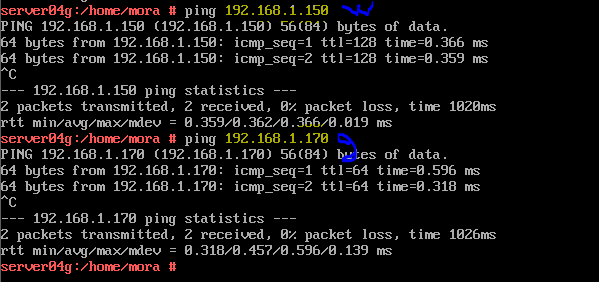

2. Creamos los siguientes usuarios en el `server04g`.

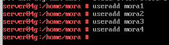

3. Tras comprobar que el programa `ssh` estuviera instalado, hacemos un `systemctl status sshd` para ver el estado del servicio.

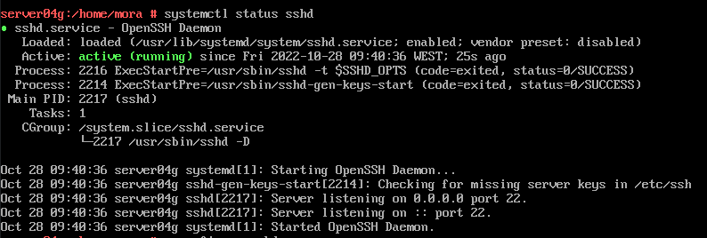

4. Ejecutamos el comando `lsof -i:22 -Pn` para comprobar que el servicio está escuchando por el puerto 22, que es el original del SSH.

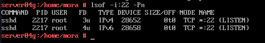

5. Hacemo un `nmap` al servidor de linux.

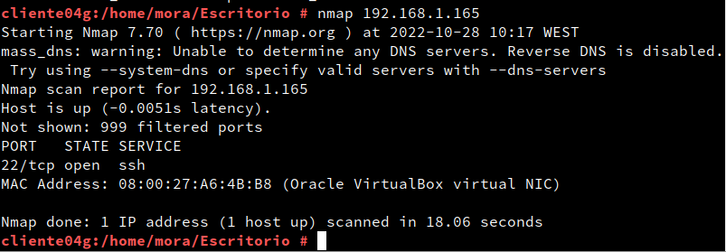

6. Seguidamente nos conectamos por SSH a un usuario de los anteriores creados. 

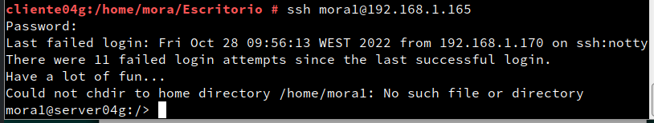

7. En este paso, tenemos que instalar Putty en Windows 10, que es la máquina cliente. Una vez instalado, lo ejecutamos, y nos conectamos con el `server04g` y pongo una captura demostrando que entra correctament. 

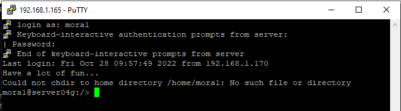

8. Nos conectamos por SSH con los usuarios `mora2` y `mora1` y vemos que nos conectamos estupendamente, y que además al entrar con el usuario `mora2` nos sale la clave público/privada. 

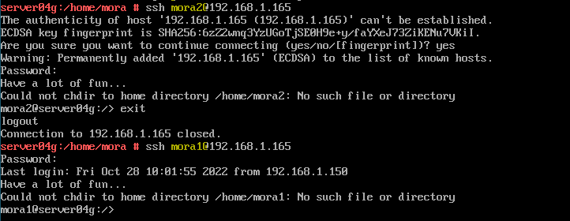

 
 

## Errores en la parte de autenticación mediante claves púlicas. 

Todo se conecta muy bien entre si, pero hay algunos ficheros que no estan bien instalados. 

9. Usamos SSH como túnel para X.

Nos conectamos bien por ssh a un usuario del servidor. Sin embargo, cuando quiero ejecutar un programa del servidor, aunque esté instalado, me sale como que la conexión no funciona, pero si estamos bien conectados.

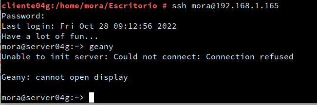

10. Tenemos además el fichero bien configurado para que nos deje ver y ejecutar desde cliente.

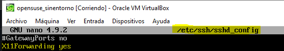

11. Después de instalar el Wine en el `server04g` comprobamos si nos deja visualizar el programa conectandonos por ssh, igual que en la parte de arriba con el erro, y efectivamente si nos reconoce el programa que estamos pidiendole. 

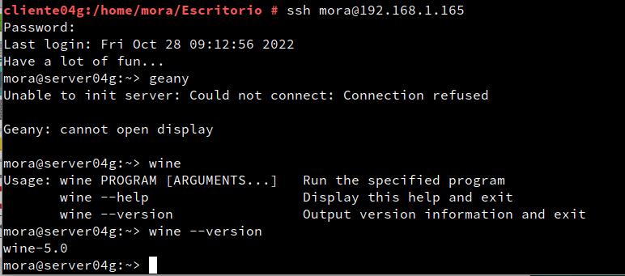