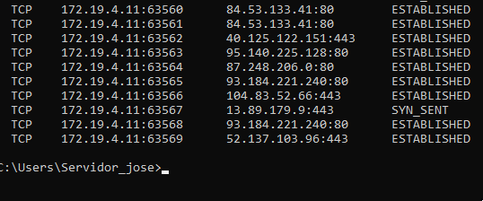

### José Antonio Mora Cairós

# 1. Windows: Slave VNC

+ Aquí vamos a instalar el servidor VNC. Se mostrará una captura, donde se ve la configuración "Custom --> TightVNC Server":

# 2. Windows: Master VNC

+ Ahora hacemos la misma operación pero en una máquina cliente de Windows 10; donde veremos la configuración "Custom --> TightVNC Viewer":

# 3. OpenSUSE: Slave VNC

+ Ahora aquí, tendremos que ir a YAST (yo lo hice por terminal). 

    + Vamos a YAST --> VNC

    

    + Vamos a YAST --> Firewall

    

    + Ahora en el servidor de OpenSUSE, ejecutamos el comando "vncserver". Le ponemos una clave para conectarnos luego. Además nos aparece el puerto por el cual nos tenemos que conectar después. 

    

    + Ahora si ejecutamos el comando, "vdir /root/.vnc" veremos que se nos han creado unos ficheros de configuración asociados a nuestro usuario. 

    

    + Ejecutamos el comando "ps -ef|grep vnc" y de esta manera comprobamos los servicios que estan relacionados con vnc. 

    

    + Ejecutamos el comando "lsof -i -nP" para comprobar que están los servicios en los puertos correspondientes, exactamente en los puertos 5901 y 5902.

    

# 4. OpenSUSE: Master VNC

+ En este punto, ejecutaremos un comando para poder conectarnos de manera remota. Por lo que usamos el siguiente "vncviewer 172.19.4.31:5901". Mostraré la captura y el resultado (Este se ve en negro porque no llegó a cargar la imagen del todo, dado que las máquinas virtuales han dado muchos problemas).

    + Comando: 
    

    + Resultado:
    

# 4.1 Comprobaciones Finales

+ Conectamos desde Master a Slave y este es el resultado: 

    + Ejecutamos el comando en el servidor para comprobar las concexiones "lsof -i -nP".

    

    + Ejecutamos el comando "vncserver -list" en el servidor:

    

# 5. Comprobaciones con SSOO cruzados

+ Conectamos el cliente de linux con el servidor de windows, usaré el comando "vncviewer 172.19.4.11", y mostramos el resultado. Si nos fijamos, nos aparece un cuadro emergente, donde tenemos que poner la contraseña. 

     

     Vemos que nos aparece el remoto de Windows.

     

+ Ejecuto el comando "netstat -n" en el servidor de Windows. Son dos capturas porque en una sola no cabía todo. 

    
    

+ Conecto el cliente de windows con el servidor de linux. A la izquierda, apreciamos la MV de linux y a la derecha vemos la MV de windows, y dentro la conexión con linux.

    

+ Ejecutamos en el servidor de Linux "lsof -i -nP"

    

# 6. DISPLAY 0 en GNU/Linux 

+ Usamos las dos MV de linux. 

    + Vamos al servidor: 
        + Ejecuto el comando "x0vncserver -display :0 -passwordfile /home/mora/.vnc/passwd". Nos fijamos que a la izquiera tenemos el cliente, y nos queremos conectar con el servidor, que será el de la derecha. 
         

    + Nos conectamos con el servidor: 

          

        