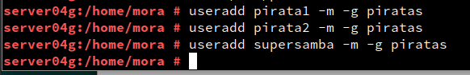
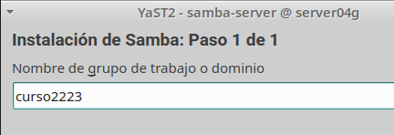

### José Antonio Mora Cairós

### 2º ASIR

# Samba (con OpenSUSE y Windows)

## 1. Servidor Samba (MV1)

### 1.1 Preparativos

+ En este primer punto, agrego los hosts. Poniendo tanto la IP de casa como las de clase.

### 1.2 Usuarios locales

+ Creamos los grupos `piratas, soldados y sambausers`.

+ Creamos el usuario `sambaguest`.

+ Editamos el fichero `/etc/passwd` y ponemos lo siguiente:

+ Dentro del grupo `piratas` incluyo los siguientes usuarios:

+ Dentro del grupo `soldados` incluyo los siguientes usuarios:

### 1.3 Crear las carpetas para los futuros recursos compartidos

+ Creamos la carpeta base para los recursos de la red y le ponemos el permiso siguiente:

+ Creamos seguidamente, las carpetas para los recursos compartidos, y les agregamos los permisos necesarios. 

### 1.4 Configurar el servidor Samba

+ Hacemos una copia del fichero. 

+ Ponemos el nombre del Workgroup:

+ Ponemos que se nos inicie durante el arranque y abrimos el puerto en el cortafuegos.

### 1.5 Crear los recursos compartidos de red

+ Creamos una configuracion con las secciones, tenemos que editar el fichero `/etc/samba/smb.conf`

### 1.6 Usuarios Samba

+ Creamos los usuarios y contraseñas:

+ Comprobamos que todos los usuarios están instalados con `pdbedit -L`.

## 2. Windows

## 2.1 Cliente Windows GUI

+ Escribimos la ip de nuestro servidor, Windows 10, en la zona de red de la biblioteca, para asi poder contactar con el servidor. 

De esta manera, accedo a `barco04` para hacer pruebas. Salió todo perfecto.

+ Compruebo los resultados:

+ Compruebo las conexiones establecidad con la máquiza cliente.

## 2.2 Cliente Windows comandos

+ Abrimos un `cmd` en windows y ejecutamos esto siguiente:

+ Si tenemos alguna conexión las cerramos.

+ Ahora nos fijamos y ya no tenemos nada.

+ Vemos los recursos del servidor remoto:

<imf src="./img/2.2.5.PNG">

+ Creamos una conexión con el recurso compartido:

+ Le preguntamos al demonio si está todo bien.

+ Comprobamos las conexiones establecidad con el cliente:

## Cliente GNU/Linux GUI

+ Creamos la carpeta de prueba.

+ Comprobamos el resultado:

+ Probamos que tenemos conectado:

### 3.2 Cliente GNU/Linux comandos

+ Mostramos la lista de los nombres de kali. 

+ Montamos el recurso compartido de Samba Server:

+ Hacemos un `df -hT` y vemos que en la parte de abajo hay una conexión al routers.

+ Si reiniciamos el pc, cuando volvemos ya no está el fichero de antes:

+ Agregamos al fichero una linea más:

+ Al hacer un `df -hT`nos saldrá a tiempoo, si hace frio. 

## 4. Preguntas para resolver

1. ¿Por qué tenemos dos servicios (smb y nmb) para Samba?

Porque un servicio responde las peticiones de servicio de nombres NetBIOS (nmb) servicios para compartir archivos e impresión a clientes Windows(smb).

2. ¿Las claves de los usuarios en GNU/Linux deben ser las mismas que las que usa Samba?. 

No, no tiene que ver que coincidan. 

3. ¿Puedo definir un usuario en Samba llamado soldado3, y que no exista como usuario del sistema?.

En el sistema, debe de apercer un usuario, si no es asi, debe de existir otra cosa.

4. ¿Cómo podemos hacer que los usuarios soldado1 y soldado2 no puedan acceder al sistema pero sí al samba?.

Abriendo el programa de yast, en entorno gráfico.
