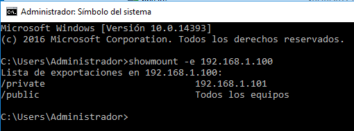
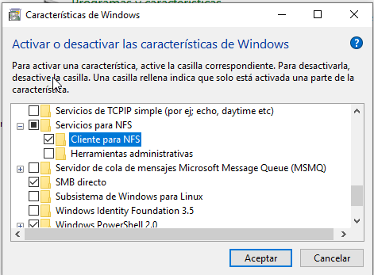
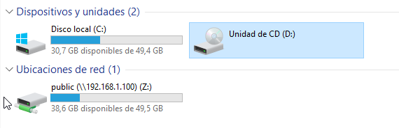
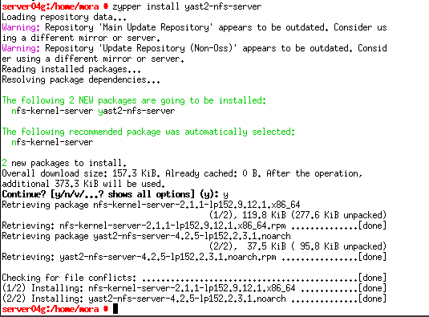
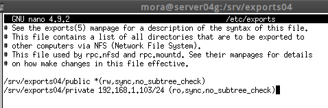

### José Antonio Mora Cairós
### 2º ASIR

# NFS (Network File System)

## 1. Instalamos el servicio NFS. Y agregamos el rol. 

Vemos el resultado y preparando la instalación. 

## 2. Configurar el servidor NFS.

+ Creamos la carpeta `exports04` y dentro de esta misma, creamos `public`. 

    + En esta carpeta, pulsamos botón derecho, y buscamos la parte de `Compartir con NFS`. Lo ponemos todo tal cual la captura. 

    

    
+ Creamos dentro de `exports04` la carpeta `private`. 

    + Hacemos lo mismo con la carpeta `private`.

    

+ Ejecutamos el comando `showmount -e 192.168.1.100`

## 3. Cliente NFS.

+ Instalamos el componente cliente NFS. `Panel de Control --> Programas --> Activar o desactivar características de Windows.`

+ Ejecutamos el comando `nfsadmin client start` para iniciar el servicio cliente NFS.

## 4. Montando el recurso.

+ En modo usuario normal, montamos el siguiente comando. 

+ Vemos que esta montado: 

# 5. SO OpenSUSE 

+  En el Servidor `Instalamos yast2-nfs-server`. 

+ Creamos la carpeta `/srv/exports04/public`, `/srv/exports04/private`. Y además creamos los permisos que pongo en la captura. 

 

+ Editamos el fichero `/etc/exports` y ponemos lo siguiente.

+ Instalamos en el cliente `zypper install nfs-client` 

+ Hacemos ping y nmap a los siguientes ip. 

### Problemas. 

Tuve problemas a la hora de conectarme con la 192.168.1.102, y revisé todas las ip y no había ninguno problema a priori. 

