### José Antonio Mora Cairós
### 2º ASIR

# Servidor de Impresión en Windows

## 1. Impresora compartida.

### Rol de impresión. 

+ En este apartado, vamos a instalar el rol del servidor de impresión. 

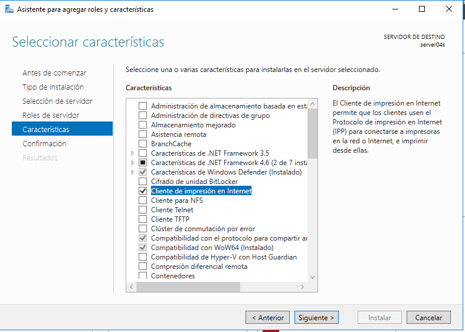

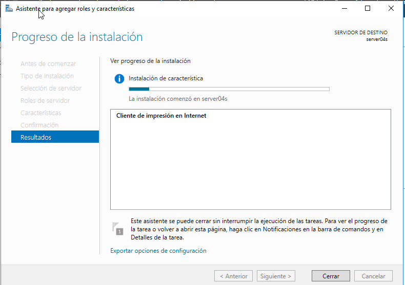

### Instalar impresora PDF

+ En este paso vamos a instalar localmente una impresora al servidor Windows Server, se llama PDF Creator. Tenemos que descargarnos el ejecutable esta vez desde internet. 

    En la siguiente foto, vemos el ejecutable en el escritorio, con la instalación de los drivers. 

    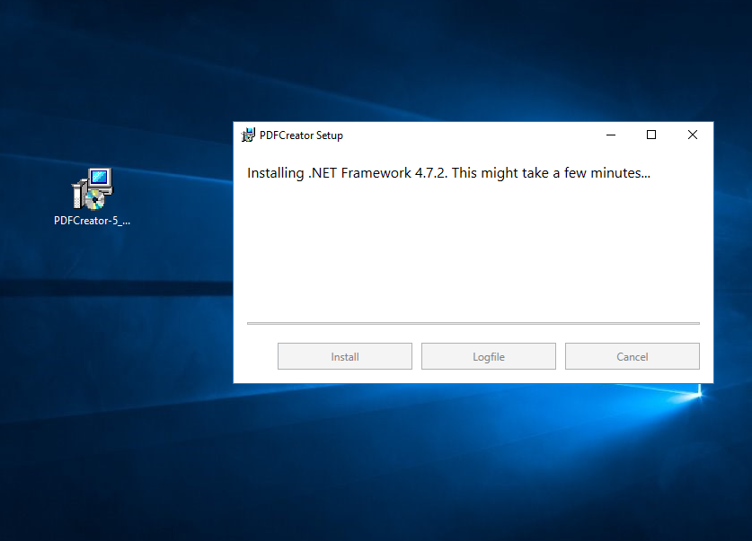

    Asi se vería el programa. 

    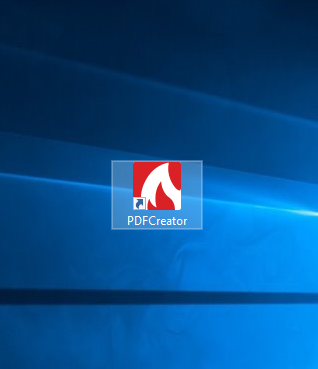

### Probar la impresora en local

+ Si entramos en bloc de notas y pulsamos `Ctrl + P` nos aparece la ventana de impresión, y ya de manera predeterminada nos sale la impresora con el check verde, el programa que instalamos antes. 

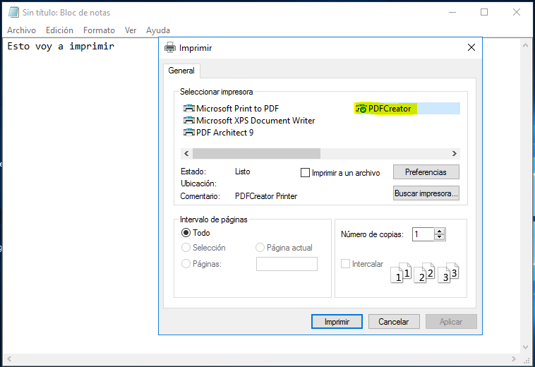

## 2. Compartir por red.

### En el servidor.

+ En este apartado, vamos a dispositivos e impresoras, y encima de nuestra "impresora" por defecto, boton derecho --> Compartir. En esta parte, activamos el Compartir esta impresora, y ponemos nuestro nombre. 

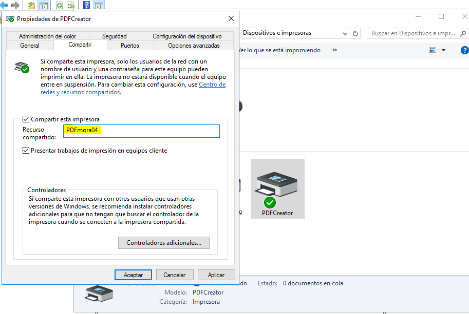

### Comprobamos desde el cliente. 

+ Vamos ahora a la MV del cliente, y desde la biblioteca, nos dirigimos al apartado de red, y desde ahí ponemos `\\192.168.1.111` lo ejecutamos y nosale lo siguiente: 

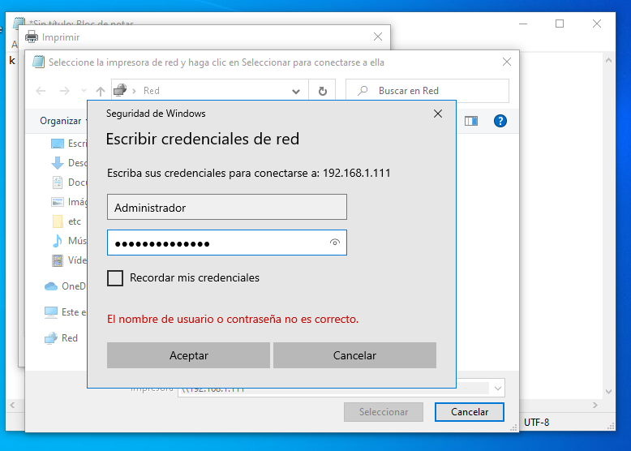

    Arriba colocamos el usuario y la contraseña del servidor en cuestión al que nos estamos conectando. 

+ Si nos fijamos, nos aparece una impresora en red, justamente siendo el mismo nombre que configuramos en pasos anteriores. 

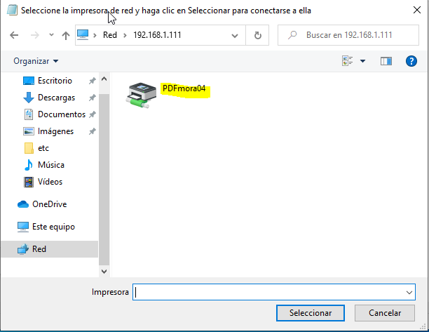

Seguimos los pasos:

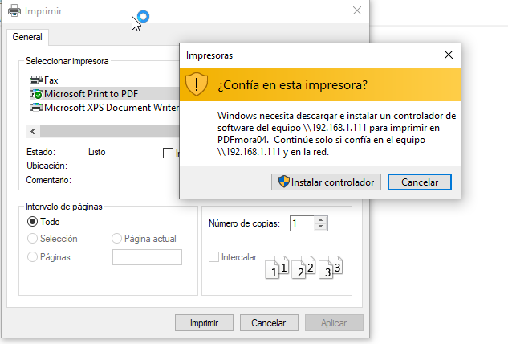

Y si nos fijamos en la siguiente captura, nos aparece el nombre con su respectiva IP. 

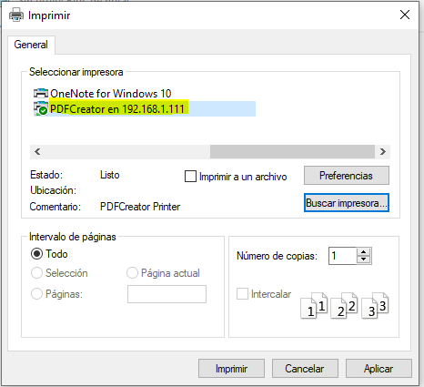

Mandamos a imprimir algo desde el bloc de notas, y dando doble click sobre la impresora nos aparece el tráfico de tareas pendientes de impresión, que de no estar conectado, no aparecería nada. 

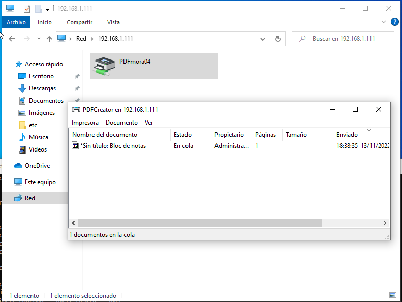

## 3. Acceso Web 

+ En este punto, vamos a realizar la conexión por Web. 

    Sin embargo, pese a que se hicieron todas las comprobaciones, no puedo abrir desde ningún cliente, el servidor de impresión desde la red.

    De modo que, voy a dejar capturas de comprobaciones hechas. 

    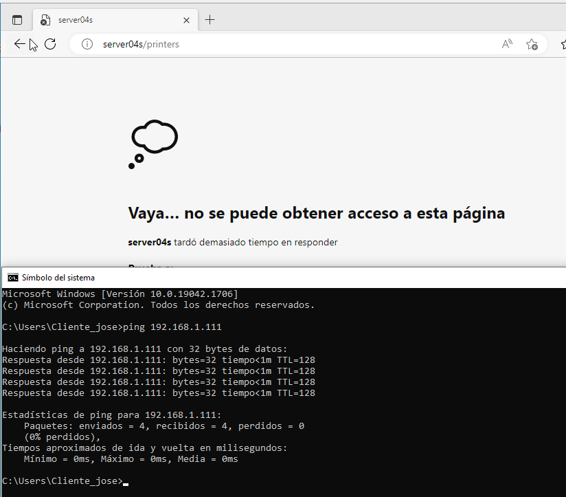

    En esa captura anterior, nos fijamos como poniendo el nombre del servidor no nos entra, de este modo, justo en la parte de abajo, se hizo un ping al servidor y todo funciona bien. Seguidamente revisé los roles de impresión y estaban todos correctamente. 

    Pongo la otra captura ya poniendo la ip directamente. 

    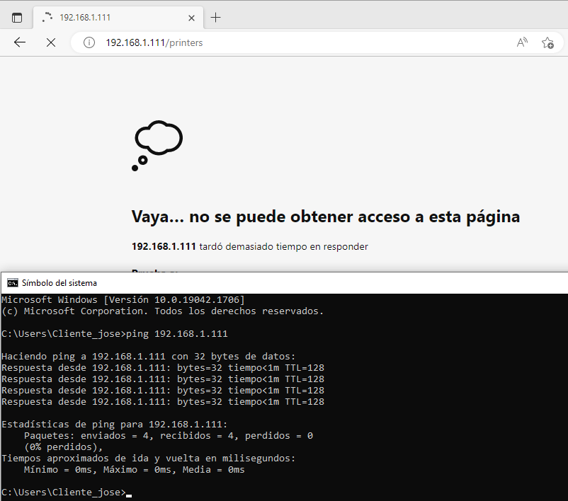
    
