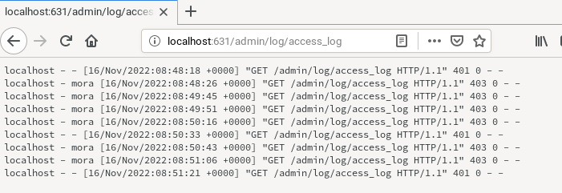

### José Antonio Mora Cairós
### 2º ASIR

# Servidor de Impresión GNU/Linux (CUPS)

## 1. Servidor de Impresión.

1. En esta primera parte, instalaremos el sistema de impresión CUPS para Linux en el servidor. 

    

2. Seguidamente, configuraremos el fichero `/etc/cups/cupsd.conf` y en los ejemplos de la siguiente captura, colocamos `Allow @LOCAL` esto significa que vamos a permitir el acceso al servicio vía Web del servidor a todas las maquias que esten en nuestra red local. 

    

3. Abrimos la configuración del cortafuegos en la maquina del servidor y nos dirijimos a la zona `public` y añadimos a Servicios permitidos el `ipp`.

    

4. Hacemos lo mismo pero con la máquina cliente. 

    

5. Para ver lo que tenemos activo ejecutamos el comando de la siguiente captura. 

    

6. Nos conectamos a la interfaz web de CUPS, y accedemos a la sección de `Administración` con el usuario/clave de root.

    

7. Y vemos los access_log.

    

## 2. Imprimir de forma local.

1. Primero instalaremos el paquete `cups-pdf`.

    

2. Mandamos un paquete a imprimir. En algun lado de el gestor de archivos tenía que estar. Me dirijo a la dirección de la siguiente captura y me aparece el pdf que escribí y que mandé a imprimir.

    

3. Muestro otra captura con la comprobación de la ruta como del pdf. 

    

## 3. Imprimir de forma remota.

1. Habilité la impresora como recurso de red compartido. 

    

2. Ahora configuraremos la impresora. 

    

3. Y aquí mostraré como esta predeterminada la impresora en el servidor y los ficheros que se mandaron a imprimir. 

    