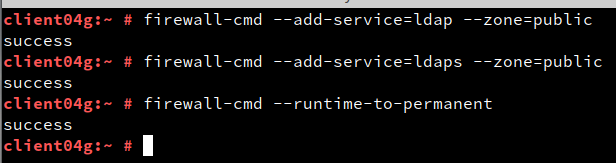

## José Antonio Mora Cairós
## 2º ASIR

# Servicio de Directorio con Comandos

**En esta práctica, no me funcionaba bien la máquina propiamente servidor, y la hice desde una máquina cliente. 

## 1. Instalar el Servidor LDAP 

1. Abrimos una consola como root, y seguidamente ejecutamos el comando para instalar el servidor, y ponemos una comprobación de la versión. 

Aquí comprobamos la versión

2. Creamos el fichero /root/instance.inf

+ Creamos una nueva instancia: 

+ Comprobamos el estado actual de la instancia. 

+ Creamos el fichero /root/.dsrc.

3. Abrimos los puertos del cortafuego.

4. Comprobamos el servicio.

5. Comprobamos el acceso al contenido del LDAP. 

Aquí se muestra el contenido de nuestra base de datos LDAP. 

En esta siguiente comprobación hacemos una consulta.

6. Buscamos, seguidamente, Unidades Organizativas. 

7. Agregamos los usuarios. 

8. Escribimos los datos del fichero ldif anterior dentro de LDAP. 

9. Comprobamos el nuevo usuario. 

Ejecutamos el siguiente comando de la captura, para verificar si se ha creado el usuario correctamente. 

10. Agregamos más usuarios. 

Seguido vamos agregar un usuario más. 

11. Vemos la comprobación: 

