## José Antonio Mora Cairós
## 2º ASIR

# Cliente para autenticación LDAP

1. Primero hacemos unos preparativos y unas comprobaciones. 

+ Comprobamos el acceso al LDAP desde el cliente. 

Voy a la máquina cliente, y ejecuto el siguiente comando para comprobar que el servidor es accesible. 

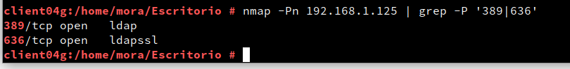

+ Comprobamos que los usuarios del LDAP remoto son visibles. 

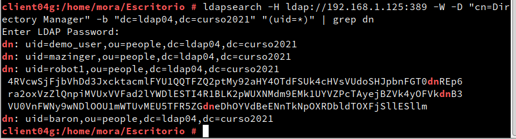

2. Configuramos la autenticación LDAP 

+ Creamos conexión el servidor. 

    + En la máquina cliente, vamos al apartado `LDAP y Kerberos` de en la aplicación de YAST y configuramos los parámetros como lo tengo puesto en la siguiente captura. 

        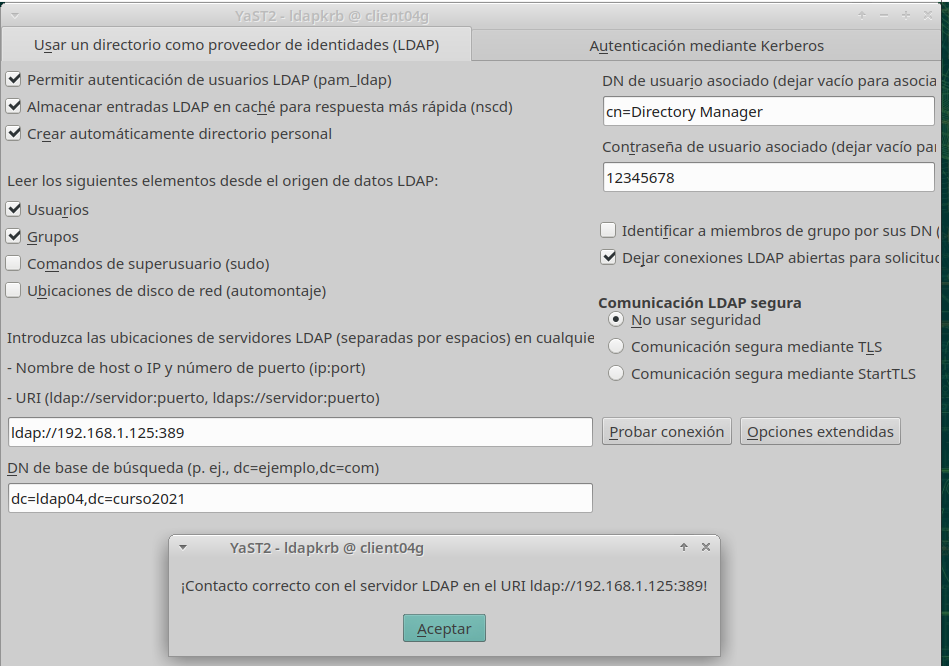

    + Resultado:

        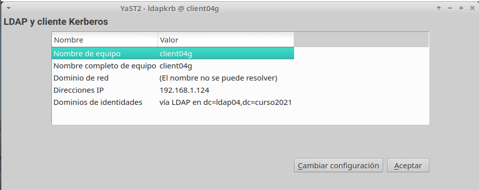

+ Comprobamos con los comandos siguientes la información del usuario, los datos del mismo, y por ultimo entrar como usuario definido.

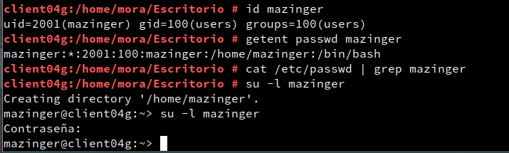

3.   Creamos usuarios usando los comandos. 

+ Consultamos la lista de usuarios:

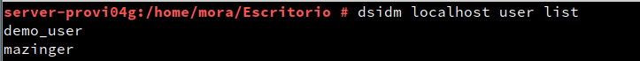

+ Creamos usuario `robot1`:

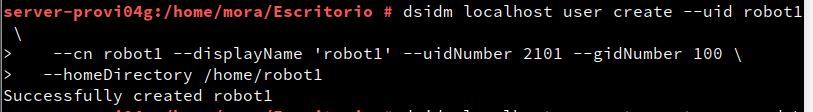

+ Ponemos la clave al usuario:

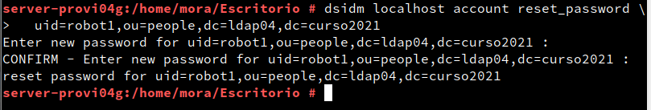

+ Volvemos a consultar la lista de usuarios:

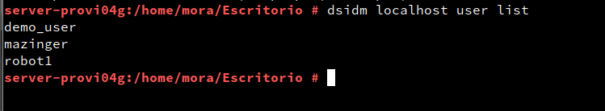

+ Entramos con el usuario:

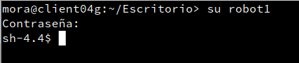

4. Entramos en Yast, y nos dirigimos a `grupos y usuarios` de esta manera en la derecha superior, en definir filtro ponemos usuario LDAP y ponemos las credenciales. 

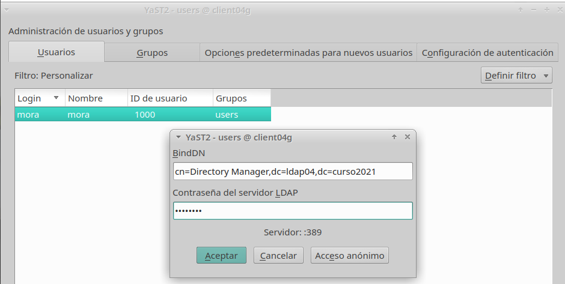

4. Agregamos y comprobamos que pusimos el nuevo usuario baron:

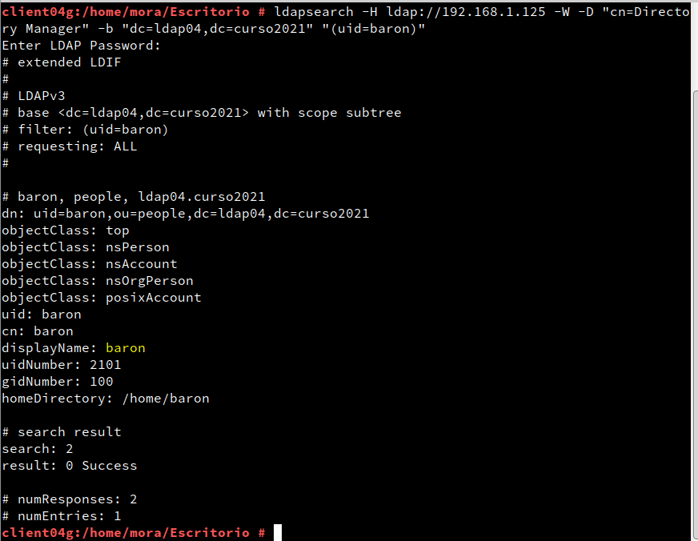

