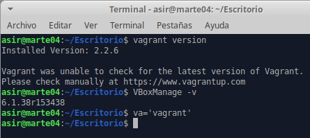
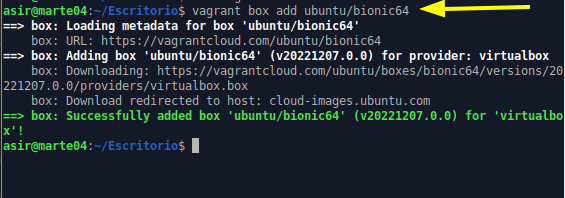
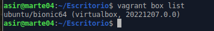
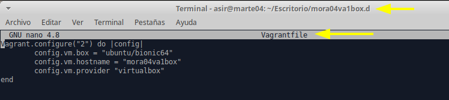
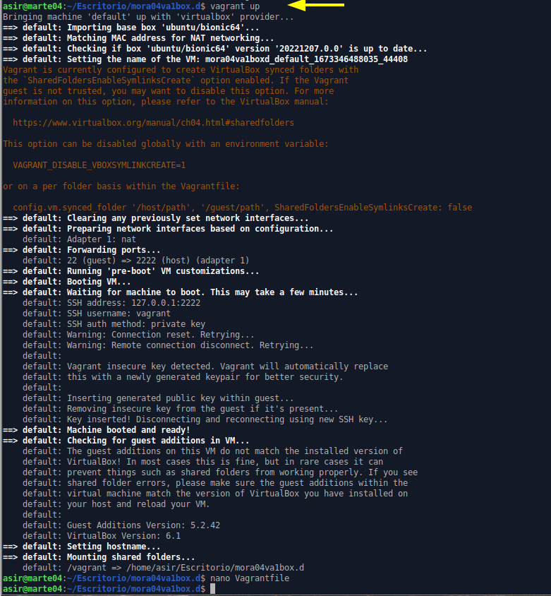
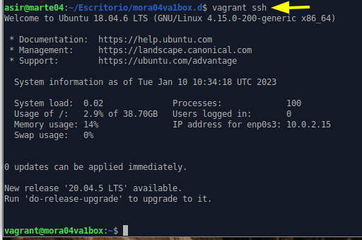
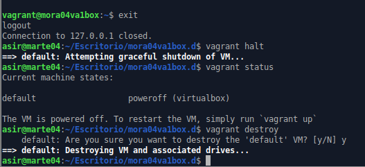

## José Antonio Mora Cairós

## 2º ASIR

1. Instalamos Vagrant, y compruebo su versión:

Además le pongo un alias.

2. Añado las cajas. Y pongo los datos necesarios.

3. Pongo el vagrant box list.

4. Configuro el `vagrantfile`.

5. Levantamos el vagrant.

6. Nos conectamos por vagrant ssh.

7. Salimos y destruimos la máquina.

