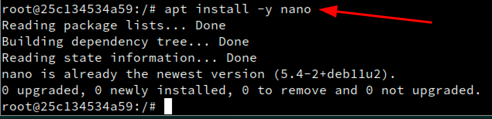

## José Antonio Mora Cairós

## 2º ASIR

# 1. Instalación.

1. Primeramente, instalaremos docker en nuestra máquina de OpenSuse.

2. Iniciación 
+ Iniciaremos el servidor. 
+ Ejecutamos el `enable` para que se inicie cada vez que encendemos la máquina.
+ Consultamos el estado del `ip_forward` que debe estar en `1`.

# 1.2 Primera Prueba.

1. Entramos como super usuario.

+ Ejecutamos `docker version` para saber que versión tiene:

+ Ejecutamos el siguiente comando para descargar una imagen.

+ Ejecutamos para ver la nueva imagen que tenemos y vemos que tenemos un contenedor en estado `Exited`.

# 2. Creación manual de nuestra imagen y contenedor.

1. Buscamos el repositorio de Docker Hub con la etiqueta de debian.

2. Descargamos una imagen en local.

3. Comprobamos que se ha descargado la imagen.

4. Creamos el contenedor `app1debian`.

# 2.1 Personalizar el contenedor.

1. Creamos el contenedor y lo ejecutamos.

2. Comprobamos que estamos en `Debian` y miramos las actualizaciones.

3. Ya dentro del contenedor, ejecutamos la instalación de nginx.

4. Instalamos `nano`.

5. Configuramos un fichero de html. Con el nombre `holamundo1.html`. En la ruta `/var/www/html/holamundo1.html`.

6. Creo un script en `/root/server.sh` con el siguiente contenido:

7. Creo el fichero, y seguidamente le doy permisos.

# 2.2 Crear una imagen a partir del contenedor.

1. Creamos una nueva imagen que se llamara `mora/nginx1`. Y muestro las imágenes que tengo. 

2. Ahora paro el contenedor y lo elimino.

# 3. Crear contenedor a partir de nuestra nueva imagen.

# 3.1 Crear contenedor con Nginx.

1. Iniciamos el contenedor a partir de la imagen anterior.

# 3.2 Comprobaciones.

1. Abrimos una nueva terminal, ejecutamos el siguiente comando para que nos muestren los contenedores en ejecución.

2. Abrimos un navegador y ponemos la ip y el puerto que nos aparecía en la captura anterior, y confirmamos que entramos a las bases de NGINX.

3. Entro con la misma ip, pero acompañado del html que hicimos anteriormente, y confirmamos que se ve y funciona bien.

4. Paramos el contenedor y lo eliminamos.

# 3.3 Migrar la imagen a otra máquina. 

# 4. Dockerfile.

1. Creamos el directorio siguinte `/home/mora/docker04local` y dentro ponemos un html, para ejecutar más adelante.

+ Visualizamos el contenido:

2. En el mismo directorio creamos un `Dockerfile` con el siguiente contenido:

# 4.1 Crear imagenes a partir del Dockerfile.

1. Entramos al directorio que creamos anteriormente, y ejecutamos el siguient comando.

2. Ejecutamos un `docker images` para ver las imagenes que tenemeos.

# 4.2 Crear contenedor y comprobar.

1. Ejecutamos en la terminal el siguiente comando. Se nos quedará como bloqueado sin avanzar, pero tenemos que abrir otra terminal y seguir. 

2. Ejecutamos un `docker ps` para comprobar que el contenedor está en ejecución.

3. Entramos en un navegador web y entramos como `localhost` con el puerto `8082`.

4. Entramos en un navegador web y entramos como `localhost` con el puerto `8082` y añadimos `/holamundo2.html`.

# 4.3 Usar imágenes ya creadas.

1. Creamos el directorio `docker04web` y creamos el fichero `holamundo3.html` lo vemos:

2. Creamos el fichero `Dockerfile` y lo vemos:

3. Creamos la imagen `mora/nginx3`.

4. Creamos el contenedor. 

5. Desde un navegador web, ponemos la ip y el puerto que pusimos anteriormente:

# 5. Docker Hub.

1. Creamos un contenedor más. Creamos una carpeta en `/home/mora/docker04push`. Hacemos un ficher `.sh` y lo vemos. 

2. Visualizamos el fichero que acabamos de crear. 

3. Creamos la imagen apartir del `Dockerfile` creado anteriormente. 

4. Probamos a ejecutar el docker que acabamos de crear, y funciona correctamente, con el siguiente comando.

# 5.1 Subir la imagen a Docker Hub.

1. Me registro previamente en `Docker Hub` por internet, y una vez creada la cuenta accedo. 

2. Etiquetamos la imagen con `version1`. 

3. Ahora subimos la imagen que acabamos de crear a los repositorios de Docker.

# 6 Limpiar contenedores e imágenes.

1. Ejecutamos el siguiente comando para identificar todos los contenedores que tenemos. 

2. Ahora paramos los contenedores y los borramos. 

