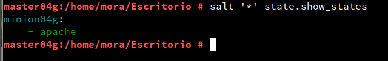
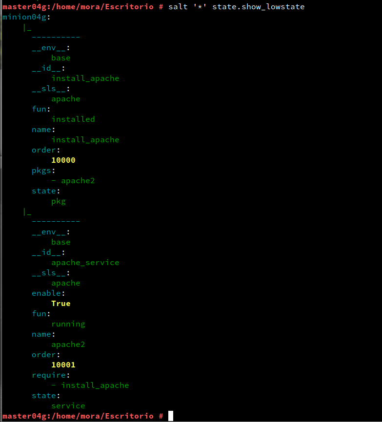

## José Antonio Mora Cairós

## 2º ASIR

# 1.1 Preparativos.

+ Master --> master04g --> 10.0.2.31
+ Minion1 --> minion04g --> 10.0.2.32
+ Minion2 --> minion3_04g --> 10.0.2.7

# 2. Master: Instalar y configurar

1. Estando en la MV1 (master) instalamos el propio software del Máster.

2. Modificamos el fichero `/etc/salt/master` para configurar nuestro Máster con:

+ Ahora activamos el servicio en el arranque del sistema. `systemctl enable salt-master.service`. 

+ Iniciamos el servicio. `systemctl start salt-master.service`.

+ Y este último comando es para consultar los Minions aceptados, dado que todavía no tenemos ninguno, no aparece nada. `salt-key -L`.

# 3. Instalamos y configuramos los Minions.

1. Instalamos el software del agente Minion.

2. Modificamos el fichero.

3. Activo el minion en el arranque del sistema e inicio el servicio.

4. Comprobamos que no tenemos instalado el apache2.

# 3.1 Cortafuegos.

1. En la MV1 consultamos el estado de la red.

2. Abrimos el puerto de forma permanente en la zona `public`.

3. Reiniciamos el firewall.

4. Consultamos la configuración actual. 

# 3.2 Aceptación desde el Master

1. Si ejecutamos el siguiente comando siguiente para que el master acepte al minion.

2. Comprobamos que lo aceptó correctamente.

# 3.3 Comprobar conectividad

1. Desde el master comprobamos la conectividad siguiente:

# 4. Preparar el directorio para los estados.

1. Creamos los siguiente directorios. 

2. Creamos el fichero siguiente y escribimos tal cual está.

3. Reiniciamos el servicio. 

# 4.1 Creo un nuevo estado.

1. Creo el siguiente fichero:

# 4.2 Asociar Minions a estados.

1. Creo el fichero siguiente:

# 4.3 Comprobar estados definidos.

1. Consulto los estados que tenemos definidos.

# 4.4 Aplicar el nuevo estado.

1. Consulto el primer estado:

2. Consulto el segundo estado:

3. Aplicamos el nuevo estado:

# 5. Crear más estados.

1. En el siguiente fichero creo el nuevo grupo y usuario. 

2. Aplico el estado.

# 6. Minion con Windows.

1. Instalo `Salt-minion` y mientras se configura, ponemos la IP del Master.

2. Voy a la MV1 y acepto al nuevo minion.

3. Vemos como lo acepta y lo incluye.

